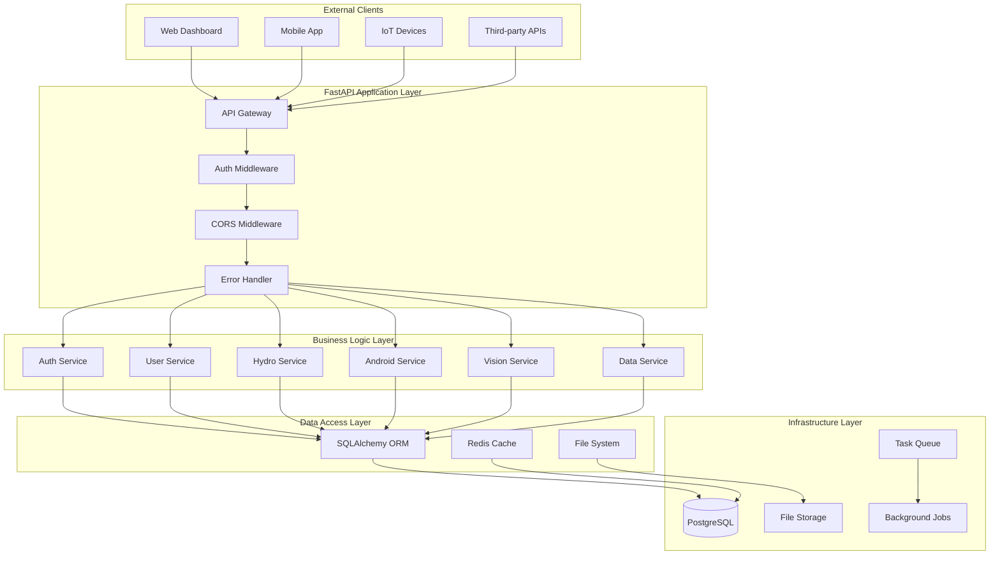
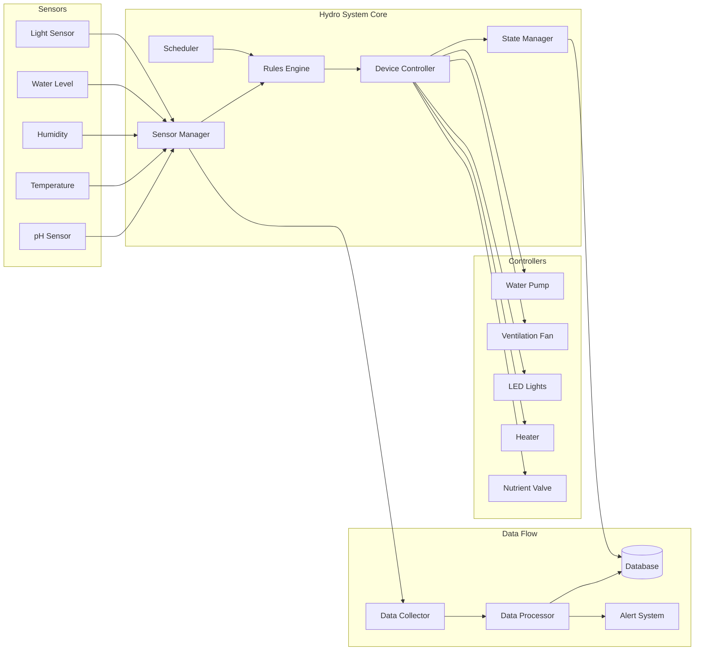
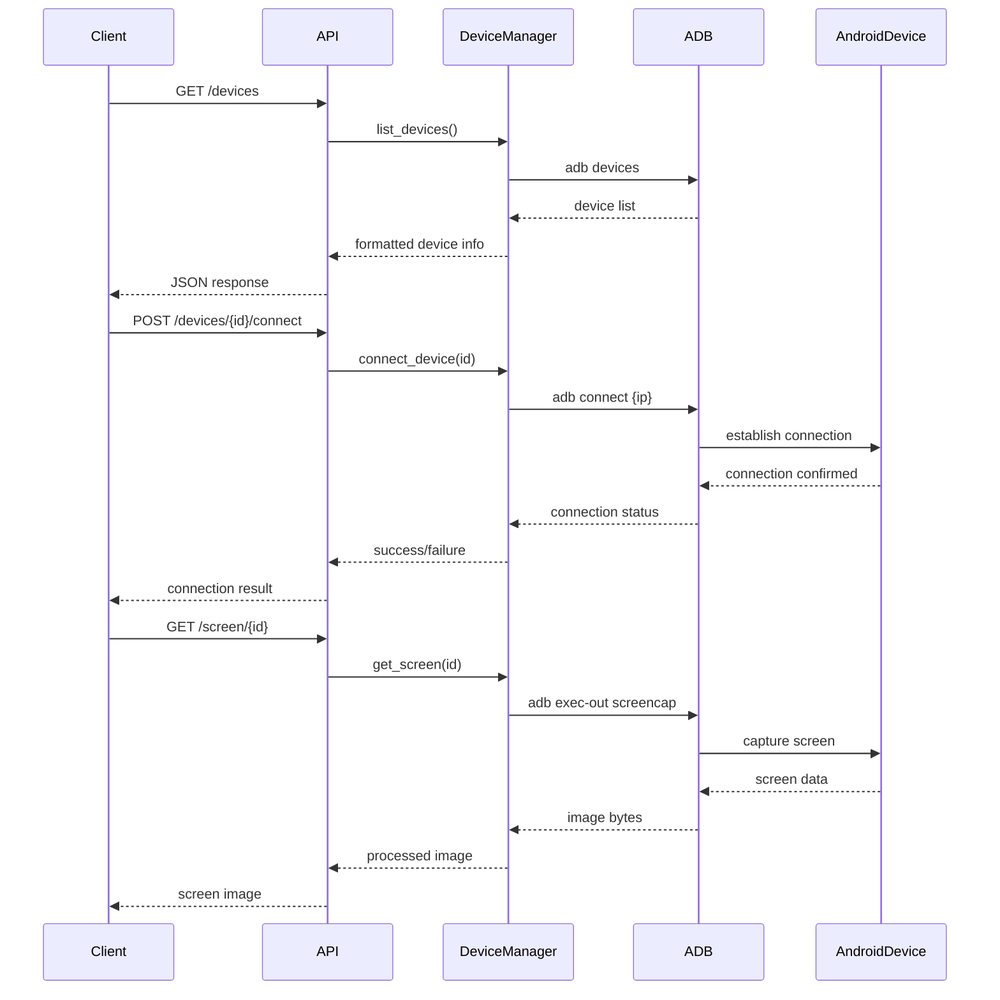
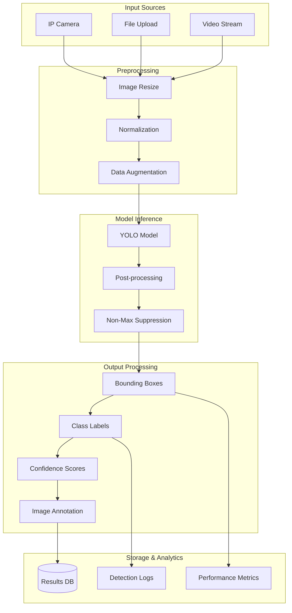
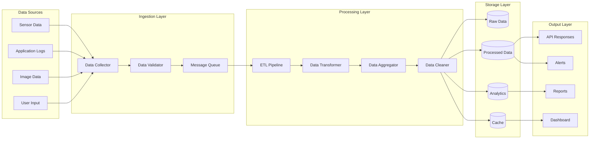
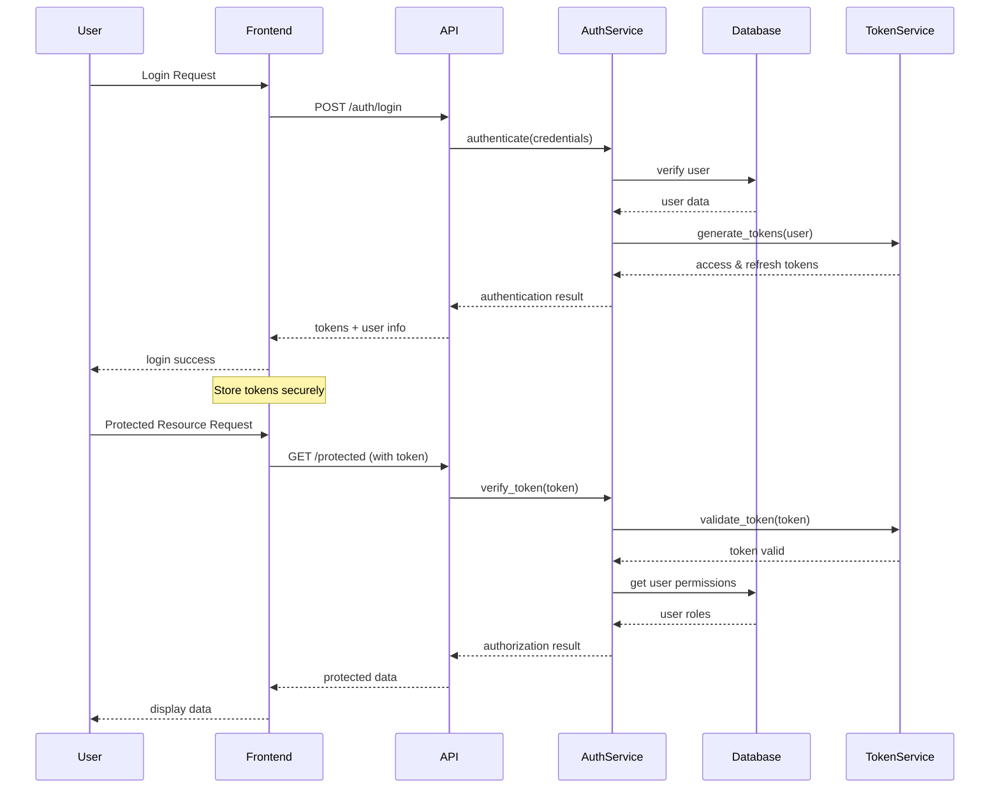
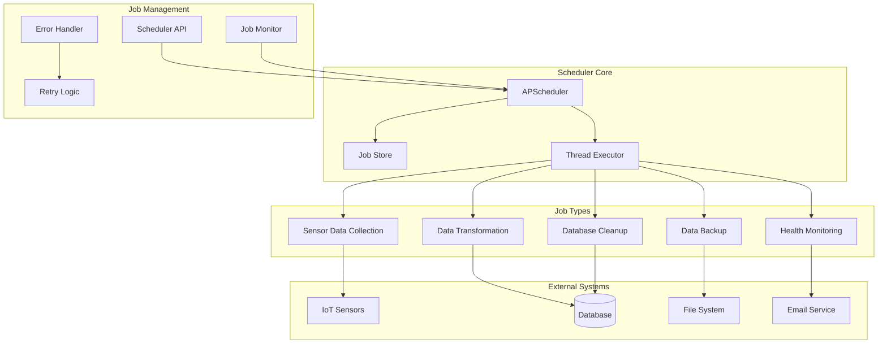
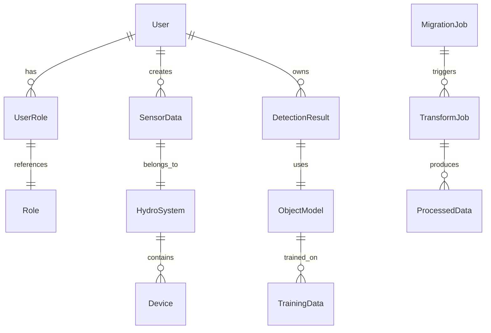
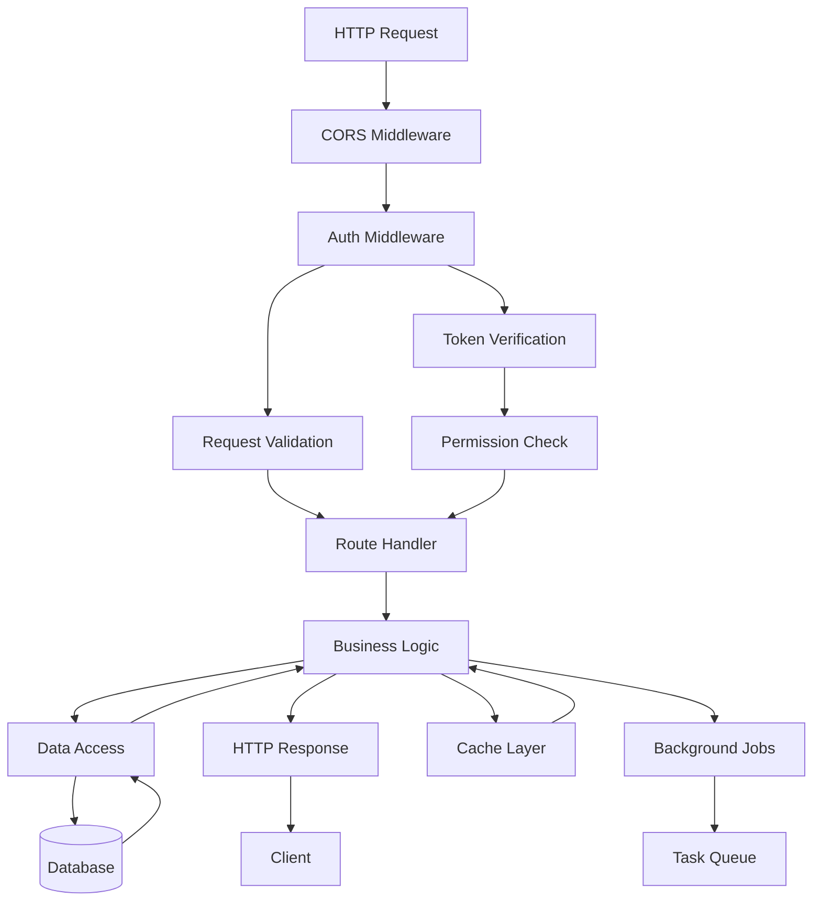

# System Architecture Documentation

## 🏗️ Detailed Architecture Diagrams

### 1. High-Level System Overview

### 2. Hydroponic System Architecture

### 3. Android Device Management Flow

### 4. Object Detection Pipeline

### 5. Data Processing Pipeline

### 6. Authentication & Authorization Flow

### 7. Background Job Architecture

## 🔧 Component Interactions

### Database Schema Overview

### API Request Flow

This architecture documentation provides a comprehensive view of how all the components in your FastAPI IoT automation system work together. The diagrams show the relationships between different modules, data flow, and system interactions.