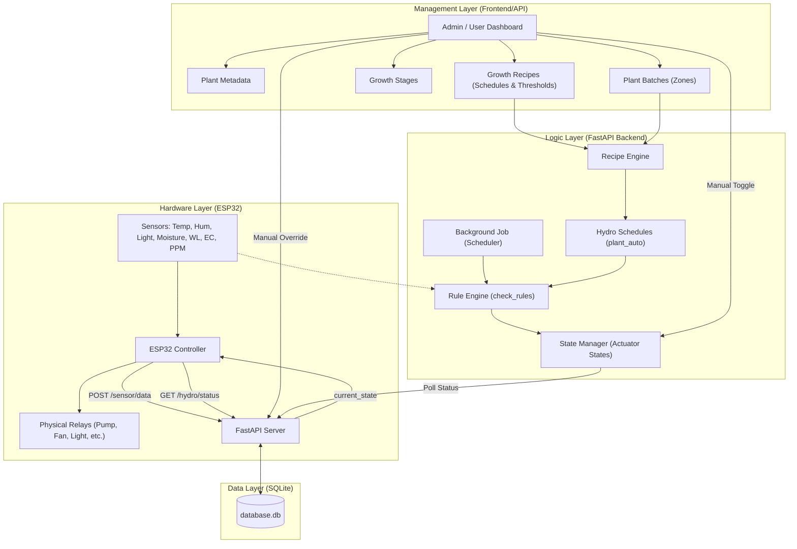
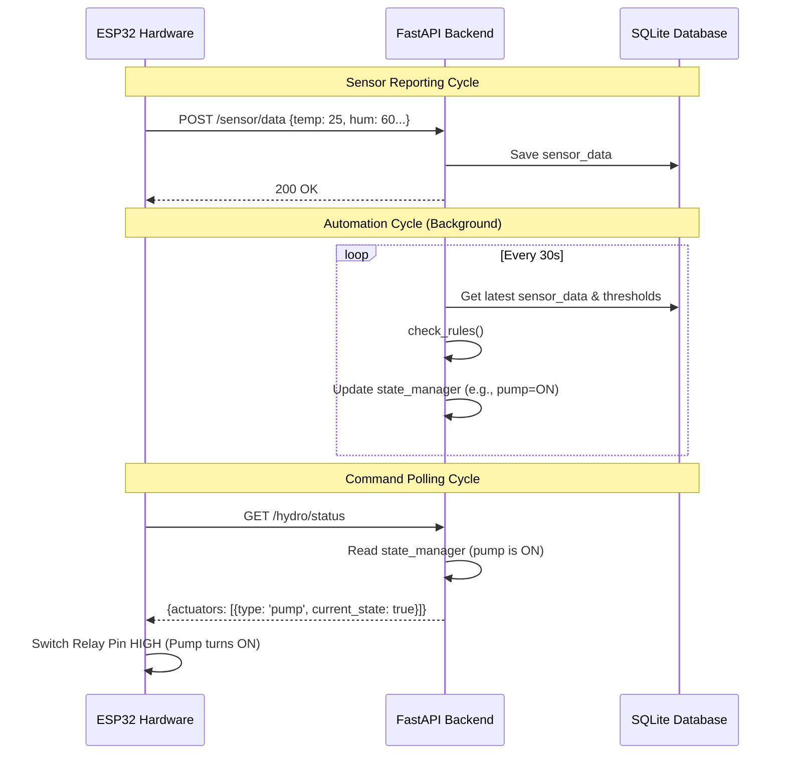

# Hydroponic System Architecture (ESP32 & FastAPI)

## Data Flow Description

1.  **Configuration**: Users define **Plants**, **Growth Stages**, and **Growth Recipes**.
2.  **Activation**: When a **Batch** is assigned a **Growth Stage**, the **Recipe Engine** generates **Hydro Schedules** (source: `plant_auto`).
3.  **Sensor Input**: **ESP32** reads sensors and sends data to `/sensor/data` every cycle.
4.  **Automation**: The **Background Job** runs `check_rules()` periodically:
    *   Checks if current time matches any **Schedules**.
    *   Checks if actuator is in an **Interval** cycle (for pumps).
    *   Checks if **Sensor Data** crosses defined **Thresholds**.
5.  **State Management**: `check_rules()` updates the **StateManager** with the desired actuator states (ON/OFF).
6.  **Control**: **ESP32** polls `/hydro/status` and applies the `current_state` to physical **Relays**.
7.  **Manual Override**: Users can manually toggle actuators via the API, which overrides automated logic in the **StateManager**.

---

## 🛰️ Integration Detail: Hardware & Backend

The system follows a **Polling & Submission** model where the ESP32 acts as the initiator for all network requests.

### 1. Sensors (Hardware → Backend)
The ESP32 samples physical sensors and submits them to the backend for storage and analysis.

- **Endpoint**: `POST /sensor/data`
- **Router**: [./app/hydro_system/routes/sensor_router.py](./app/hydro_system/routes/sensor_router.py)
- **Logic**: Data is saved to the `sensor_data` table and immediately becomes available for the **Rule Engine**.

### 2. Commands (Backend → Hardware)
The ESP32 polls the backend for its "Desired State" rather than the backend pushing commands.

- **Endpoint**: `GET /hydro/status?device_id=X`
- **Router**: [./app/hydro_system/routes/system_router.py](./app/hydro_system/routes/system_router.py)
- **Logic**: The backend returns a JSON object containing the `current_state` (ON/OFF) for every actuator registered to that device from the [./app/hydro_system/state_manager.py](./app/hydro_system/state_manager.py).
- **Hardware Action**: The ESP32 parses the JSON and sets its GPIO pins high/low to match.

### 3. Automation vs Manual Control
The `state_manager` determines the final state based on:
- **Manual Overrides**: API calls to `/hydro/pump/on` or `/hydro/light/off`.
- **Automated Rules**: The background scheduler evaluating `check_rules()` against latest sensor data and recipes.

---

## 🔄 Communication Sequence

