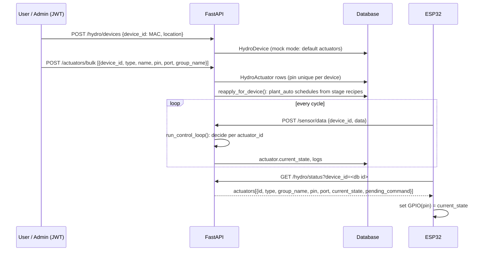

# Hydroponic System Module Documentation

## Overview

The **Hydro System Module** manages ESP32-based hydroponic devices and their actuators (pumps, lights, fans, valves, water sensors). It provides device CRUD operations, actuator control, sensor data collection, and automation rules based on environmental thresholds.

## Architecture

```
app/hydro_system/
├── models/              # SQLAlchemy ORM models
│   ├── device.py        # HydroDevice (ESP32 mainboard)
│   ├── actuator.py      # HydroActuator (pump, light, fan, valve, water_pump)
│   ├── schedule.py      # HydroSchedule (time-based rules)
│   ├── actuator_log.py  # HydroActuatorLog (historical actions)
│   ├── sensor_data.py   # SensorData (temperature, humidity, moisture, water level)
│   ├── plant.py         # Plant metadata
│   ├── plant_batch.py   # PlantBatch (growing session)
│   ├── growth_stage.py  # GrowthStage (seedling, veg, bloom)
│   └── growth_recipe.py # GrowthRecipe (specific actuator settings for a stage)
├── schemas/             # Pydantic validation schemas
│   ├── device.py        # HydroDevice schemas
│   ├── actuator.py      # HydroActuator schemas
│   ├── schedule.py      # HydroSchedule schemas
│   ├── batch.py         # PlantBatch schemas
│   ├── growth_stage.py  # GrowthStage schemas
│   ├── growth_recipe.py # GrowthRecipe schemas
│   └── sensor_data.py   # SensorData schemas
├── controllers/         # Business logic
│   ├── device_controller.py        # Device CRUD + control logic
│   ├── actuator_controller.py      # Actuator + automation handling
│   ├── system_controller.py        # System status + emergency
│   └── recipe_engine_controller.py # Recipe application logic
├── services/            # Data access layer
│   ├── device_service.py           # Device DB queries
│   ├── actuator_service.py         # Actuator DB queries
│   ├── plant_batch_service.py      # Batch DB queries
│   ├── growth_stage_service.py     # Stage DB queries
│   ├── growth_recipe_service.py    # Recipe DB queries
│   ├── schedule_service.py         # Schedule DB queries
│   └── automation_service.py       # Orchestration service for growth cycles and control loops
├── routes/              # API endpoints
│   ├── device_router.py            # Device endpoints
│   ├── actuator_router.py          # Actuator endpoints
│   ├── batch_router.py             # PlantBatch + Stage endpoints
│   └── system_router.py            # System endpoints
├── config.py            # Configuration (device IDs, thresholds, actuator types)
├── rules_engine.py      # Automation rules for actuator control
├── scheduler.py         # Background sensor collection job
├── sensors.py           # Sensor reading implementations
└── state_manager.py     # In-memory state tracking
```

## Database Models

### HydroDevice (ESP32 Mainboard)

**Table:** `devices_hydro`

Represents an ESP32 microcontroller that controls hydroponic equipment.

| Field | Type | Description |
|-------|------|-------------|
| `id` | Integer | Primary key |
| `name` | String | Device name (e.g., "Greenhouse Pump Controller") |
| `device_id` | String (Unique) | External device identifier (MAC address, serial number, or UUID) |
| `user_id` | Integer (FK) | User who owns the device |
| `client_id` | String | Multi-tenant client identifier |
| `external_id` | String (Unique, Optional) | Alternative external identifier |
| `location` | String (Optional) | Physical location (e.g., "Greenhouse A", "Farm Building 2") |
| `type` | String (Optional) | Device type (typically "controller") |
| `is_active` | Boolean | Whether device is enabled for hardware communication |
| `thresholds` | JSON (Optional) | Per-device automation thresholds (overrides global config) |
| `actuators` | Relationship | One-to-many relationship to HydroActuator |
| `created_at` | DateTime | Timestamp when device was created |
| `updated_at` | DateTime | Timestamp of last update |

**Example:**
```json
{
  "id": 1,
  "name": "Greenhouse A Controller",
  "device_id": "esp32-dev-001",
  "user_id": 5,
  "client_id": "client_001",
  "location": "Greenhouse A",
  "type": "controller",
  "is_active": true,
  "thresholds": {
    "moisture_min": 35,
    "temperature_max": 26
  }
}
```

### HydroActuator (Physical Equipment)

**Table:** `hydro_actuators`

Represents individual hardware components (pumps, lights, fans, valves, water sensors) connected to a device.

| Field | Type | Description |
|-------|------|-------------|
| `id` | Integer | Primary key |
| `type` | String | Actuator type: `pump`, `light`, `fan`, `water_pump`, `valve` |
| `name` | String (Optional) | Human-readable name (e.g., "Pump 1", "Grow Light A") |
| `pin` | String (Optional) | GPIO pin identifier (e.g., "D1", "GPIO23") |
| `port` | Integer | GPIO pin number on ESP32 |
| `is_active` | Boolean | Whether actuator is enabled for control |
| `default_state` | Boolean | Initial/default state (ON=true, OFF=false) |
| `control_mode` | String | Control mode: `binary`, `pulse`, `pwm` |
| `control_params` | JSON | Parameters for pulse/pwm mode |
| `device_id` | Integer (FK) | Parent device |
| `sensor_key` | String (Optional) | Linked sensor type (e.g., "temperature", "humidity") |
| `created_at` | DateTime | Creation timestamp |
| `updated_at` | DateTime | Last update timestamp |
| `group_name` | String(50), optional, indexed | Free-text label (e.g. `"row_a"`, `"north_lights"`) used by recipes to target a subset of actuators of the same type. Set via `POST/PUT /actuators`. |

Also fix the type list: lights must keep `type="light"`. Distinguish them with `name` and `group_name`, **never** by inventing types such as `light_1`. Unknown types are not loaded by `automation_service` (only `SUPPORTED_ACTUATOR_TYPES` are), have no registered rule, and never match recipes.

**Supported Types:**
- `pump` - General pump control
- `light` - Grow lights
- `fan` - Exhaust/circulation fans
- `water_pump` - Water circulation/refill
- `valve` - Water valve control
- `nutrient_pump` - Nutrient dosing pump

**Example:**
```json
{
  "id": 10,
  "type": "pump",
  "name": "Main Water Pump",
  "pin": "D1",
  "port": 1,
  "is_active": true,
  "default_state": false,
  "device_id": 1,
  "sensor_key": "water_level"
}
```

### SensorData

**Table:** `sensor_data`

Historical readings from sensors (temperature, humidity, moisture, water level, ec, ppm).

| Field | Type | Description |
|-------|------|-------------|
| `id` | Integer | Primary key |
| `device_id` | Integer (FK) | Parent device |
| `temperature` | Float | Temperature reading (°C) |
| `humidity` | Float | Humidity reading (%) |
| `light` | Float | Light intensity (lux) |
| `moisture` | Float | Soil moisture (%) |
| `water_level` | Float | Water level (%) |
| `ec` | Float | Electrical Conductivity (mS/cm) |
| `ppm` | Float | Parts Per Million (PPM) |
| `created_at` | DateTime | When reading was taken |

### HydroSchedule (Time-based Rules)

**Table:** `hydro_schedules`

Defines specific times when an actuator should be automatically turned on or off.

| Field | Type | Description |
|-------|------|-------------|
| `id` | Integer | Primary key |
| `actuator_id` | Integer (FK) | Linked actuator |
| `start_time` | Time | When to turn ON |
| `end_time` | Time | When to turn OFF |
| `repeat_days` | String | Comma-separated days (e.g., "mon,tue,wed") |
| `is_active` | Boolean | Whether schedule is enabled |

### HydroActuatorLog (Historical Actions)

**Table:** `hydro_actuator_logs`

Audit trail of all actuator state changes.

| Field | Type | Description |
|-------|------|-------------|
| `id` | Integer | Primary key |
| `actuator_id` | Integer (FK) | Linked actuator |
| `action` | String | Action taken ("on", "off", "toggle") |
| `state` | String | Resulting state ("ON", "OFF") |
| `source` | String | Who triggered ("user", "scheduler", "rule_engine") |
| `note` | String | Optional reason or context |
| `timestamp` | DateTime | When action occurred |

### Plant (Metadata)

**Table:** `plants`

Defines different species of plants (e.g., Lettuce, Tomato).

| Field | Type | Description |
|-------|------|-------------|
| `id` | Integer | Primary key |
| `name` | String | Species name |
| `description` | Text | Planting details |

### PlantBatch (Growing Session)

**Table:** `plant_batches`

A specific growing session linked to a plant and a device (zone).

| Field | Type | Description |
|-------|------|-------------|
| `id` | Integer | Primary key |
| `plant_id` | Integer (FK) | Linked plant species |
| `current_stage_id` | Integer (FK) | Currently active growth stage |
| `zone_id` | Integer (FK) | Device (HydroDevice) where this batch grows |
| `start_date` | Date | When the session started |
| `status` | String | "growing", "harvested", "failed" |

### GrowthStage (Stage Definition)

**Table:** `growth_stages`

Specific phases of growth for a plant (e.g., "Seedling", "Vegetative").

| Field | Type | Description |
|-------|------|-------------|
| `id` | Integer | Primary key |
| `plant_id` | Integer (FK) | Parent plant |
| `name` | String | Stage name |
| `day_start` | Integer | Day index when stage begins |
| `day_end` | Integer | Day index when stage ends |

### GrowthRecipe (Automation Settings)

**Table:** `growth_recipes`

| Field | Type | Description |
|-------|------|-------------|
| `id` | Integer | Primary key |
| `stage_id` | Integer (FK) | Linked growth stage |
| `actuator_type` | String | Required. `"light"`, `"pump"`, ... |
| `group_name` | String(50), optional | Narrow the target to actuators of that type with the same `group_name` |
| `actuator_id` | Integer (FK), optional | Pin the recipe to one specific actuator. Must be of the same type, and is only applied when that actuator belongs to the batch's zone (device) |
| `action` | String | `"on"` (time window) or `"interval"` (pump cycling) |
| `start_time` / `end_time` | Time | Window for `on`; optional window for `interval` |
| `interval_on_min` / `interval_off_min` | Integer | Cycle lengths for `interval` |

### Target resolution (specificity rules)

A recipe selects actuators on the batch's zone (`PlantBatch.zone_id` = `HydroDevice.id`):

| Recipe fields set | Targets |
|---|---|
| `actuator_type` only | every active actuator of that type on the zone |
| `actuator_type` + `group_name` | active actuators of that type whose `group_name` matches |
| `actuator_id` (+ type) | exactly that actuator, if it is active and on the zone; otherwise skipped with a warning |

If several recipes of a stage hit the same actuator, the **most specific one wins** (id > group > type). Recipes of equal specificity stack, so two `on` windows for one light both produce schedules. Lower-specificity recipes are skipped for any actuator already claimed by a more specific recipe.

Why `group_name` is the primary mechanism: a `GrowthPlan` belongs to a plant and is reused across batches and zones, while an `actuator_id` is bound to one ESP32. Use `actuator_id` only for plans that are intentionally tied to one device.

## Control Logic & Priority

The system uses a centralized rules engine (`rules_engine.py`) to determine the state of each actuator. Decisions are made based on a strict priority hierarchy to ensure safety and allow for manual intervention.

### Priority Hierarchy

When multiple rules conflict, the system follows this order of precedence (from highest to lowest):

1.  **Safety Rules (Critical)**:
    *   **High Temperature**: If temperature exceeds `temperature_critical` (default 35°C), fans are forced **ON**.
    *   **Low Water Level**: If water level falls below `water_level_critical` (default 10%), all pumps (`pump`, `water_pump`, `nutrient_pump`) are forced **OFF** to prevent dry running.
    *   *Note: Safety rules cannot be overridden by manual mode or automation.*

2.  **Manual Override**:
    *   Controlled via the `manual_state` attribute on the actuator.
    *   `True`: Forces the actuator **ON**.
    *   `False`: Forces the actuator **OFF**.
    *   `None` (Default): Resumes **AUTO** mode (passes control to lower priorities).

3.  **One-Shot Actions**:
    *   Temporary, timed runs (e.g., "Run pump for 60 seconds").
    *   Triggered via specialized API endpoints or internal logic.

4. **Schedules**: windows in `hydro_schedules`, per actuator. Produced by `manual` entries or by recipes with `action="on"` (`source="plant_auto"`).

5. **Intervals**: `hydro_schedules` rows with `interval_on_min`/`interval_off_min`, produced by recipes with `action="interval"`. The rules engine reads them from the actuator's schedules; it no longer falls back to a type-wide recipe, so an actuator overridden by a more specific recipe cannot be re-captured by a broader one.

6.  **Sensor Thresholds**:
    *   Dynamic response to environment data.
    *   Example: "Turn fan ON if temperature > 28°C" or "Turn pump ON if moisture < 30%".

### Rules Engine Implementation

The `check_rules()` function evaluates all active rules for an actuator and returns a single `final_on` state along with the `reason` for that decision (e.g., `"safety_high_temp"`, `"manual_on"`, `"schedule"`, `"sensor"`).

### Automation Pipeline Integration

The system operates as a continuous pipeline where multiple components coordinate during every 60-second cycle:

1.  **The Pulse (Scheduler)**: The background job wakes up every 60 seconds to initiate a system check.
2.  **The Context (Automation Service)**: Identifies the active `PlantBatch` for the device and retrieves the `GrowthRecipe` for the current `GrowthStage`.
3.  **The Decision (Rule Engine)**: Receives live sensor readings, active recipes, and time-based schedules. It evaluates them using the priority hierarchy (Safety > Manual > Schedule > Recipe > Sensor).
4.  **The Action (Actuator Controller)**: Executes the final decision by sending signals to the hardware and logging the state change.

## API Endpoints

### Device Management

#### List Devices

```http
GET /hydro/devices?skip=0&limit=100&user_id=5&client_id=client_001
```

**Query Parameters:**
- `skip` (int, default=0): Pagination offset
- `limit` (int, default=100): Items per page
- `user_id` (int, optional): Filter by user
- `client_id` (string, optional): Filter by client

**Response:** `List[HydroDeviceOut]`

**Behavior:**
- SuperAdmin sees all devices
- Regular users see only their client's devices
- If no filters provided, returns current user's client devices

**Example:**
```json
[
  {
    "id": 1,
    "name": "Greenhouse A Controller",
    "device_id": "esp32-dev-001",
    "location": "Greenhouse A",
    "is_active": true,
    "user_id": 5,
    "created_at": "2025-01-15T10:30:00Z",
    "updated_at": "2025-01-15T14:22:00Z"
  }
]
```

#### Get Device by ID

```http
GET /hydro/devices/{device_id}
```

**Path Parameters:**
- `device_id` (int, required): Device internal ID

**Response:** `HydroDeviceOut`

#### Create Device

```http
POST /hydro/devices
Content-Type: application/json

{
  "name": "Greenhouse B Controller",
  "device_id": "esp32-dev-002",
  "location": "Greenhouse B",
  "type": "controller",
  "is_active": true
}
```

**Authenticated:** Required (user_id and client_id auto-assigned from JWT)

**Request Body:**
- `name` (string, required): Device name
- `device_id` (string, required): External device identifier (must be unique)
- `location` (string, optional): Physical location
- `type` (string, optional): Device type
- `is_active` (boolean, optional, default=true)
- `external_id` (string, optional): Alternative identifier
- `thresholds` (object, optional): Automation thresholds override

**Response:** `HydroDeviceOut` (201 Created)

**Behavior (Mock Mode):**
- Default actuators are automatically created based on `config.DEFAULT_ACTUATORS`

#### Update Device

```http
PUT /hydro/devices/{device_id}
Content-Type: application/json

{
  "name": "Updated Greenhouse A",
  "location": "Greenhouse A Updated",
  "thresholds": {
    "moisture_min": 40,
    "temperature_max": 25
  }
}
```

**Path Parameters:**
- `device_id` (int, required)

**Request Body:** `HydroDeviceUpdate` (all fields optional)

**Response:** `HydroDeviceOut`

#### Delete Device

```http
DELETE /hydro/devices/{device_id}
```

**Path Parameters:**
- `device_id` (int, required)

**Response:** `{"detail": "Device deleted successfully"}`

#### Activate Device

```http
POST /hydro/devices/{device_id}/activate
```

**Path Parameters:**
- `device_id` (int, required)

**Response:** `HydroDeviceOut`

**Behavior:**
- Sets `is_active = true`
- Enables hardware heartbeat and communication
- Activates automation rules for this device

#### Deactivate Device

```http
POST /hydro/devices/{device_id}/deactivate
```

**Path Parameters:**
- `device_id` (int, required)

**Response:** `HydroDeviceOut`

**Behavior:**
- Sets `is_active = false`
- Disables hardware communication
- Pauses automation rules

### Device Location Control

#### Control Devices by Location

```http
POST /hydro/devices/location/{location}/control?on=true
```

**Path Parameters:**
- `location` (string, required): Physical location (e.g., "Greenhouse A")

**Query Parameters:**
- `on` (boolean, required): true=turn ON, false=turn OFF

**Response:**
```json
{
  "location": "Greenhouse A",
  "state": "ON",
  "devices_controlled": 1,
  "details": [
    {
      "device_id": 1,
      "device_name": "Greenhouse A Controller",
      "location": "Greenhouse A",
      "actuators_controlled": [
        {
          "actuator_id": 10,
          "name": "Main Water Pump",
          "type": "pump",
          "state": "ON"
        },
        {
          "actuator_id": 11,
          "name": "Grow Light A",
          "type": "light",
          "state": "ON"
        }
      ]
    }
  ]
}
```

**Behavior:**
1. Queries all devices matching the specified `location`
2. For each device, controls **all actuators** (turns them ON or OFF)
3. Uses `control_actuator_by_id()` to toggle each actuator
4. Logs actuator state changes
5. Returns detailed control results per device

**Error Responses:**
- `404 Not Found`: No devices at specified location
- `500 Internal Server Error`: Actuator control failure

**Example Requests:**
```bash
# Turn ON all devices in Greenhouse A
curl -X POST "http://localhost:8000/hydro/devices/location/Greenhouse%20A/control?on=true"

# Turn OFF all devices in Farm Building 2
curl -X POST "http://localhost:8000/hydro/devices/location/Farm%20Building%202/control?on=false"
```

### Actuator Management

#### Get Actuators by Device

```http
GET /actuator/device/{device_id}
```

**Path Parameters:**
- `device_id` (int, required): Device internal ID

**Response:** `List[HydroActuatorOut]`

#### Create Actuator

```http
POST /actuator
Content-Type: application/json

{
  "name": "Pump A",
  "type": "pump",
  "port": 1,
  "pin": "D1",
  "device_id": 1,
  "is_active": true,
  "default_state": false,
  "sensor_key": "water_level"
}
```

**Request Body:** `HydroActuatorCreate`

**Response:** `HydroActuatorOut` (201 Created)

#### Update Actuator

```http
PUT /actuator/{actuator_id}
```

**Path Parameters:**
- `actuator_id` (int, required)

**Request Body:** `HydroActuatorUpdate` (all fields optional)

**Response:** `HydroActuatorOut`

### Sensor Data & Analytics

#### Get Latest Sensor Data

```http
GET /sensor/data
```
Returns the latest readings for all sensors.

#### Get Thresholds

```http
GET /sensor/thresholds
```

#### Update Thresholds

```http
POST /sensor/thresholds
```

#### Submit Sensor Data

```http
POST /sensor/data
```
Submit new readings (typically used by ESP32 devices).

#### Water Level Status

```http
GET /sensor/water-level/status
```
Returns current water level with analysis and recommendations.

#### Water Level History

```http
GET /sensor/water-level/history?hours=24
```

#### Water Consumption Analysis

```http
GET /sensor/water-level/consumption?hours=24
```
Predicts when the tank will be empty based on usage.

### System Control & Status

#### Get System Status

```http
GET /hydro/status?device_id=1
```

**Query Parameters:**
- `device_id` (int, optional): Filter by device. If not provided, returns all devices for user's client.

**Response:** `List[dict]` containing sensor data, actuator states, growing batch overview, and automation status per device.

**Example Item:**
```json
{
  "device_id": 1,
  "device_name": "Greenhouse A Controller",
  "sensors": { "temperature": 24.5, ... },
  "growing_batch": {
    "id": 5,
    "plant_name": "Lettuce",
    "days_growing": 12,
    "current_stage": "Vegetative",
    "status": "growing"
  },
  "actuators": [...],
  "automation": { ... }
}
```

#### Individual Actuator Control

```http
POST /hydro/{actuator_type}/on?device_id=1
POST /hydro/{actuator_type}/off?device_id=1
```

**Supported Types:** `pump`, `light`, `fan`, `water-pump`

#### Water Tank Refill

```http
POST /hydro/water-tank/refill?device_id=1&duration=300
```

**Query Parameters:**
- `duration` (int, default=300): Refill time in seconds (30s to 1800s).

#### Emergency Stop

```http
POST /hydro/emergency-stop
```
Turns OFF all actuators for all devices belonging to the user.

#### Control Actuator by ID

```http
POST /hydro/actuator/{actuator_id}/on
POST /hydro/actuator/{actuator_id}/off
```

#### Scheduler Control

```http
POST /hydro/scheduler/start
POST /hydro/scheduler/stop
POST /hydro/scheduler/restart
```
Starts, stops, or restarts the background sensor collection and automation job.

### Schedule Management

#### Create Schedule
```http
POST /hydro/schedules
```

#### List Schedules by Actuator
```http
GET /hydro/schedules/actuator/{actuator_id}
```

#### Update Schedule
```http
PATCH /hydro/schedules/{schedule_id}
```

#### Delete Schedule
```http
DELETE /hydro/schedules/{schedule_id}
```

### Actuator Logs

#### Fetch Logs
```http
GET /hydro/actuator-logs?actuator_id=1&device_id=esp32-001&start_time=ISO_TIMESTAMP&end_time=ISO_TIMESTAMP
```
Retrieves historical actions taken on actuators.

### Plant Batch Management

#### Create Batch
```http
POST /batches
```

#### List Batches
```http
GET /batches
```

#### Set Batch Stage
```http
POST /batches/{batch_id}/set-stage/{stage_id}
```
**Behavior:**
1. Updates `current_stage_id` for the batch.
2. Identifies all `GrowthRecipe` records for the new stage.
3. Deletes existing `plant_auto` schedules for the batch's device.
4. Creates new `HydroSchedule` records for time-based recipes.
5. Updates internal rules engine to handle interval-based recipes.

## Configuration

### File: `app/hydro_system/config.py`

#### Device IDs
```python
DEVICE_IDS = [
    "esp32-dev-001",
    "esp32-dev-002",
    "esp32-dev-003",
]
```

#### Default Thresholds
```python
DEFAULT_THRESHOLDS = {
    "moisture_min": 30,        # % - soil moisture
    "light_min": 300,          # lux - light intensity
    "temperature_max": 28,     # °C - max temperature
    "water_level_min": 20,     # % - min water level
    "water_level_critical": 10, # % - emergency alert level
    "ec_min": 1.2,             # mS/cm - min EC
    "ec_max": 2.5,             # mS/cm - max EC
    "ppm_min": 600,            # ppm - min PPM
    "ppm_max": 1000            # ppm - max PPM
}
```

#### Default Actuators (Mock Mode)
```python
DEFAULT_ACTUATORS = [
    {"type": "pump", "name": "Pump A", "port": 1, ...},
    {"type": "light", "name": "Grow Light A", "port": 2, ...},
    ...
]
```
Created automatically when device is created in mock mode.

#### Actuator Types
```python
ACTUATOR_TYPES = {
    "pump": {"emoji_on": "✅", "label": "Pump"},
    "light": {"emoji_on": "💡", "label": "Light"},
    "fan": {"emoji_on": "🌪️", "label": "Fan"},
    "water_pump": {"emoji_on": "💧", "label": "Water Pump"},
    "valve": {"emoji_on": "🔓", "label": "Valve"},
    "nutrient_pump": {"emoji_on": "🧪", "label": "Nutrient Pump"},
}
```

#### Supported Actuator Types
```python
SUPPORTED_ACTUATOR_TYPES = ["pump", "light", "fan", "water_pump", "valve", "nutrient_pump"]
```

#### Water Level Config
```python
WATER_LEVEL_CONFIG = {
    "sensor_type": "ultrasonic",
    "tank_height_cm": 50,
    "max_volume_liters": 100,
    "calibration_offset": 2
}
```

## Service layer: RecipeEngineService

Responsibilities:
- `apply_stage_recipes(db, batch, recipes)`: delete the zone's `plant_auto` schedules, sort recipes by specificity (most specific first), resolve targets, build `HydroSchedule` rows, never commit.
- `reapply_for_stage(db, stage_id)` / `reapply_for_device(db, device_id)`: regenerate schedules after recipe or actuator edits.
- Schedules stay per actuator (`HydroSchedule.actuator_id`), so the rules engine and ESP32 are unaffected by how a recipe selected its targets.


### HydroDeviceService

**Location:** `app/hydro_system/services/device_service.py`

**Key Methods:**

| Method | Signature | Purpose |
|--------|-----------|---------|
| `create_device()` | `(db, device_in: HydroDeviceCreate) -> HydroDevice` | Create new device, auto-create default actuators |
| `get_device()` | `(db, device_id: int) -> HydroDevice` | Fetch by internal ID |
| `get_device_by_external_id()` | `(db, external_id: str) -> HydroDevice` | Fetch by device_id (mac/uuid) |
| `get_device_for_user()` | `(db, device_id: int, user_id: int) -> HydroDevice` | Fetch device for specific user |
| `get_devices_by_location()` | `(db, location: str) -> List[HydroDevice]` | Fetch all devices at a location |
| `get_devices_by_user()` | `(db, user_id: int) -> List[HydroDevice]` | Fetch user's devices |
| `get_devices_by_client()` | `(db, client_id: str) -> List[HydroDevice]` | Fetch client's devices |
| `get_first_active_device()` | `(db) -> HydroDevice` | Get the first active device for fallback |
| `get_fallback_device_id()` | `(db) -> str` | Get a valid device ID from DB or config |
| `get_or_create_default_device()` | `(db) -> HydroDevice` | Ensure at least one device exists |
| `update_device()` | `(db, device: HydroDevice, updates) -> HydroDevice` | Update device fields |
| `delete_device()` | `(db, device: HydroDevice) -> None` | Delete device and cascading actuators |
| `set_device_active()` | `(db, device_id: int, active: bool) -> HydroDevice` | Toggle device active status |
| `control_devices_by_location()` | `(db, location: str, on: bool) -> dict` | Control all devices at location |

### HydroActuatorService

**Location:** `app/hydro_system/services/actuator_service.py`

| Method | Signature | Purpose |
|--------|-----------|---------|
| `create_actuator()` | `(db, actuator_in) -> HydroActuator` | Create actuator |
| `get_actuator()` | `(db, actuator_id: int) -> HydroActuator` | Fetch by ID |
| `get_actuators_by_device()` | `(db, device_id: int) -> List[HydroActuator]` | Fetch device's actuators |
| `get_actuators_by_device_and_type()` | `(db, device_id, type) -> List[HydroActuator]` | Filter by device and type |
| `get_all_actuators_by_type()` | `(db, type, device_id)` | Fetch all of a specific type |
| `get_active_actuators_by_type()` | `(db, type, device_id)` | Fetch only active actuators of type |
| `update_actuator()` | `(db, actuator_id, updates) -> HydroActuator` | Update actuator |
| `delete_actuator()` | `(db, actuator_id: int) -> bool` | Delete actuator |
| `update_actuators_by_type()` | `(db, device_id, type, value) -> List[HydroActuator]` | Bulk toggle default state |

## Controllers

### device_controller.py

Acts as a facade between routes and services. Adds error handling and logging.

**Key Functions:**

```python
# Device CRUD
create_device(db, device_in)
get_device(db, device_id)
get_devices_by_user(db, user_id)
get_devices_by_client(db, client_id, skip, limit)
get_all_devices(db, skip, limit)
update_device(db, device_id, updates)
delete_device(db, device_id)

# Device Control
activate_device(db, device_id)
deactivate_device(db, device_id)
control_devices_by_location(db, location, on)  # NEW
```

### actuator_controller.py

Manages actuator state and hardware control.

**Key Functions:**

```python
# Actuator Control
control_actuator(db, device_type, on, device_id)
control_actuator_by_id(db, actuator_id, on)

# Automation
handle_automation(db, sensor_data, device_id)
log_device_action(name, device_type, state, ...)
```

### system_controller.py

Orchestrates complex system actions and provides status summaries.

**Key Functions:**

```python
get_system_status(db, user_id, device_id)
control_actuator(db, actuator_type, on, user_id, device_id)
control_actuator_by_id(db, actuator_id, on)
refill_water_tank(db, user_id, device_id, duration)
emergency_stop(db, user_id)
scheduler_control(action, user_id, device_id) # action: start|stop|restart
```

## Usage Examples

### Create a Device

```bash
curl -X POST "http://localhost:8000/hydro/devices" \
  -H "Authorization: Bearer <token>" \
  -H "Content-Type: application/json" \
  -d '{
    "name": "Greenhouse A Controller",
    "device_id": "esp32-dev-001",
    "location": "Greenhouse A",
    "type": "controller"
  }'
```

### Control All Devices at a Location

```bash
# Turn ON
curl -X POST "http://localhost:8000/hydro/devices/location/Greenhouse%20A/control?on=true" \
  -H "Authorization: Bearer <token>"

# Turn OFF
curl -X POST "http://localhost:8000/hydro/devices/location/Greenhouse%20A/control?on=false" \
  -H "Authorization: Bearer <token>"
```

### Get Devices by Location (Service Usage)

```python
from app.hydro_system.services.device_service import hydro_device_service

devices = hydro_device_service.get_devices_by_location(db, "Greenhouse A")
# Returns: List[HydroDevice]
```

### Update Device Thresholds

```bash
curl -X PUT "http://localhost:8000/hydro/devices/1" \
  -H "Authorization: Bearer <token>" \
  -H "Content-Type: application/json" \
  -d '{
    "thresholds": {
      "moisture_min": 35,
      "temperature_max": 26,
      "water_level_min": 25
    }
  }'
```

## Data Flow

### Device Location Control Flow

```
POST /hydro/devices/location/{location}/control?on=true
  ↓
device_router.control_devices_by_location()
  ↓
device_controller.control_devices_by_location()
  ↓
device_service.get_devices_by_location(db, location)
  ↓ (for each device)
device_service.actuator_service.control_actuator_by_id()
  ↓
state_manager.set_state()
  ↓ (send to ESP32 hardware via MQTT/Serial/API)
```

### Automation Flow

```
Sensor Collection Job (60s interval)
  ↓
sensors.read_sensor_data()
  ↓
automation_service.run_control_loop()
  ↓ (fetch recipes for current batch)
rules_engine.check_rules(sensor_data, thresholds, recipes)
  ↓
actuator_controller.control_actuator_by_id()  (if rule triggered)
  ↓
state_manager.set_state()
  ↓
log_actuator_action()
```

### Plant Batch & Stage Flow

```
POST /batches/{batch_id}/set-stage/{stage_id}
  ↓
batch_router.set_batch_stage()
  ↓
recipe_engine_controller.apply_stage_recipes()
  ↓
schedule_service.delete_by_device_and_source(source="plant_auto")
  ↓ (for each GrowthRecipe in stage)
  ↓ (if time-based recipe: start_time & end_time set)
schedule_service.bulk_create(source="plant_auto")
  ↓ (if interval-based recipe: action="interval")
rules_engine.is_in_interval()  (Evaluated during handle_automation cycle)
```

## Background Jobs

### Sensor Collection Job

- **File:** `app/hydro_system/scheduler.py`
- **Frequency:** Every 60 seconds
- **Actions:**
  1. Collects sensor data (temperature, humidity, moisture, water level, ec, ppm)
  2. Persists readings to `SensorData` table
  3. Executes `automation_service.run_control_loop()`
  4. Evaluates automation rules via `rules_engine.check_rules()`
  5. Controls actuators if conditions are met
  6. Generates alerts if critical levels reached

### Batch Stage Update Job

- **File:** `app/hydro_system/scheduler.py`
- **Frequency:** Every 12 hours
- **Actions:**
  1. Executes `automation_service.run_growth_cycle()`
  2. Calculates `days_growing` for each active batch (`today - start_date`).
  3. Finds the matching `GrowthStage` based on `day_start <= days_growing <= day_end`.
  4. Automatically updates the batch to the new stage if a transition is needed.
  5. Triggers `recipe_engine_controller.apply_stage_recipes()` to update hardware schedules and automation rules.

## State Management

### State Manager

**File:** `app/hydro_system/state_manager.py`

In-memory storage for actuator states (ON/OFF).

```python
from app.hydro_system.state_manager import set_state, get_state

# Set state
set_state("pump_1_1", True)  # Turn pump ON

# Get state
is_on = get_state("pump_1_1")
```

**State Key Format:** `{actuator_type}_{device_id}_{port}`

Example: `pump_1_1` = pump on device 1, port 1

## Troubleshooting

### Device Not Responding

1. Check device `is_active` status
2. Verify `device_id` matches ESP32 configuration
3. Check network connectivity
4. Review scheduler logs for sensor collection errors

### Automation Not Triggering

1. Verify `is_active = true` on device
2. Check thresholds in device config or database
3. Review `rules_engine.py` logic
4. Check sensor data is being collected (look at `SensorData` table)

### No Devices at Location

1. Verify device `location` field is set correctly
2. Ensure devices are in the correct client
3. Check user permissions (SuperAdmin can see all)

## Security Considerations

1. **Authentication:** All endpoints require valid JWT token
2. **Authorization:** Users see only their client's devices (SuperAdmin sees all)
3. **Input Validation:** Pydantic schemas validate all inputs
4. **SQL Injection:** SQLAlchemy ORM prevents SQL injection
5. **Device ID Uniqueness:** `device_id` is unique at database level

## Future Enhancements

- [ ] WebSocket real-time actuator state updates
- [ ] Device grouping/zones (multiple devices per location)
- [ ] Historical analytics dashboard
- [ ] Hardware firmware update management
- [ ] MQTT integration for remote devices
- [ ] Alerts/notifications (email, SMS)
- [ ] Per-actuator control at location level

## Related Files

- **Models:** `app/hydro_system/models/`
- **Schemas:** `app/hydro_system/schemas/`
- **Routes:** `app/hydro_system/routes/system_router.py` (main entry point)
- **Scheduler:** `app/hydro_system/scheduler.py`
- **Configuration:** `app/hydro_system/config.py`
- **Main App:** `main.py` (register scheduler and routers)

## API changes

### Actuators
`POST /actuators`, `PUT/PATCH /actuators/{id}` accept and return `group_name`. Changing `type`, `is_active` or `group_name` re-applies the current stage's schedules for that device.

### Recipes (`/batches/recipes`, `/batches/stages/{id}/with-recipes`)
```json
{ "stage_id": 3, "actuator_type": "light", "group_name": "row_a",
  "action": "on", "start_time": "06:00:00", "end_time": "18:00:00" }
```
```json
{ "stage_id": 3, "actuator_type": "pump", "actuator_id": 12,
  "action": "interval", "interval_on_min": 5, "interval_off_min": 25 }
```
Validation: `actuator_id` must exist and its type must equal `actuator_type` (HTTP 400 otherwise).

### System status
Each item in `actuators` of `GET /hydro/status` now includes `group_name`.

## [ADD] Device lifecycle and command flow (ESP32)



**Commands are addressed per actuator, never by type or group.**
- `id` is the stable identity; `pin` is the GPIO the firmware drives; `port` is a logical index.
- Type and group only exist on the backend: they decide *which actuators a recipe schedules*. The ESP32 only receives the resulting `current_state` of each actuator.
- Firmware should drive hardware by `pin` (parse as an integer; store plain digits like `"25"`, not `"PIN031"`) and key its state by `id`.
- `pending_command` (`"stop"`) is delivered once per poll, then cleared.

Known gaps:
1. `/hydro/status` takes the DB `device.id` and a user JWT. A device-scoped credential and lookup by external `device_id` (as `POST /sensor/data` already does) would be better for firmware.
2. `sync_device_actuators_from_hardware` is still a stub, so on real hardware actuators must be created manually.

## Migration

Run once: `python migrate_recipe_targets.py`. It is idempotent, backs up the SQLite file, adds `hydro_actuators.group_name`, `growth_recipes.group_name`, `growth_recipes.actuator_id` and indexes. Existing recipes keep working unchanged (both new fields are NULL = type-wide).