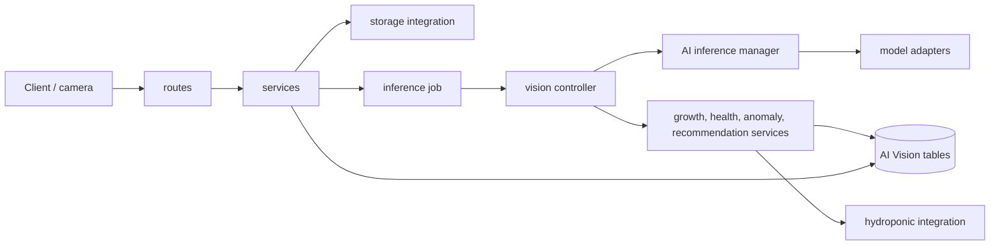

# AI Vision Module

## Objective

`ai_vision` analyzes plant images and stores traceable results for the hydroponics application. Its current pipeline:

1. receives an uploaded plant image;
2. queues and safely claims an inference job;
3. runs detection and health-classification adapters;
4. records predictions, growth, health, anomalies, and recommendations;
5. exposes the result through REST endpoints.

The current inference models are mock adapters. Real YOLO or classifier models should replace adapter implementations only; routes and business services should not need to change.

## Architecture



## Folder Structure

```text
app/ai_vision/
├── ai/                 # Model abstraction, preprocessing, inference adapters
├── controllers/        # Cross-service workflows and transaction boundaries
├── integrations/       # Boundaries to storage, cameras, and hydro_system
├── jobs/               # Scheduler entry points for background work
├── models/             # SQLAlchemy database models
├── repositories/       # Reusable database queries and persistence helpers
├── routes/             # FastAPI HTTP endpoints
├── schemas/            # Pydantic request and response contracts
├── services/           # Domain business logic
├── utils/              # Small shared helpers without business ownership
├── config.py           # Environment-backed module settings
└── README.md           # This guide
```

## Layer Responsibilities

### `routes/`

Routes define HTTP paths, accept Pydantic request data, obtain a database session, and call a service or controller. Keep routes thin: do not place inference, SQL queries, or business rules here.

Current route groups include plants/cameras, images, inference, health/growth/anomalies, and recommendations.

### `schemas/`

Schemas are the API contract. Add or change request validation and response fields here first. Keep schemas separate from SQLAlchemy models so database changes do not accidentally become public API changes.

### `controllers/`

Controllers orchestrate multi-step workflows. `vision_controller.py` is the owner of the complete analysis transaction:

```text
predictions → growth → health → anomalies → recommendation → final job status
```

Services called by this controller may use `db.flush()` to receive database IDs, but they must not commit. The controller commits a complete pipeline or rolls it back and marks the job failed.

### `services/`

Services implement one business capability each:

- `image_service.py` — image ingestion and initial inference queueing.
- `inference_job_service.py` — active-job reuse, atomic claims, and expired lease recovery.
- `vision_service.py` — converts model results into prediction records.
- `growth_service.py` — canopy growth and baseline calculations.
- `health_service.py` — health score and sensor-context calculation.
- `anomaly_service.py` — anomaly rules and persisted evidence.
- `recommendation_service.py` — explainable recommendations with `pending_review` status.
- `plant_service.py` — plant and camera operations.

Create a new service when a new capability has its own rules and data. Do not make one large "vision service" for unrelated concerns.

### `jobs/`

`jobs/inference_job.py` is called by the application scheduler. It finds queued jobs and asks `inference_job_service` to atomically claim each one before running the controller.

Jobs use a lease. A worker that crashes after claiming a job leaves it in `processing`; a later poll requeues it after `AI_JOB_LEASE_SECONDS` (default: 600). Long-running real models may need a larger value.

### `ai/`

This is the model-facing layer:

- `base/vision_model.py` defines the common model interface.
- `inference/inference_manager.py` selects and runs registered models.
- `inference/detector.py` and `inference/classifier.py` contain current mock adapters.
- `preprocessing/` and `postorocessing/` are reserved for image input/output transformations.

When adding a real model, implement the existing model interface and register it in `InferenceManager.MODEL_REGISTRY`. Return the established result shape (`task`, model name/version, confidence, raw output) so downstream services stay unchanged.

> Note: `postorocessing/` is currently misspelled in the directory name. Preserve it until imports are migrated together, then rename it in one dedicated change.

### `models/`

SQLAlchemy models define the module's tables:

- plants and cameras;
- uploaded images;
- inference jobs and predictions;
- growth and health records;
- anomalies and recommendations.

Add database fields here and create a proper migration for deployed databases. `python -m app.init_db` creates missing tables for local development, but does not alter existing tables.

### `repositories/`

Repositories contain reusable database query patterns. Keep query composition here when it is shared or non-trivial. Services should decide *why* data is read or written; repositories decide *how* to query it.

### `integrations/`

Integrations are adapters to code or systems outside this module:

- `storage_client.py` saves image files;
- `camera_client.py` loads image data for inference;
- `hydroponic_client.py` obtains sensor and flow context from `hydro_system`.

Do not import `hydro_system` directly from routes or domain services. Add integration methods instead so the dependency remains isolated and replaceable.

### `utils/`

Use utilities only for small, stateless shared helpers such as validation or image formatting. Business decisions belong in services, not utilities.

## Safe Extension Rules

1. Add HTTP input/output fields in `schemas/`, then use them from a thin route.
2. Put a new business rule in the relevant service.
3. Put multi-service sequencing in a controller.
4. Do not call `db.commit()` from a pipeline service; let the controller own the transaction.
5. Run expensive inference through a claimed background job, never directly during image upload.
6. Keep model-specific code inside `ai/` and retain model name/version in every prediction.
7. Add a migration whenever a deployed model/table changes.

## Local Workflow

Create missing development tables with:

```cmd
python -m app.init_db
```

Start the application normally. The scheduler polls inference jobs every 15 seconds. For an image, either wait for the queue or call the manual analysis endpoint immediately; do not manually re-analyze a completed image unless an additional historical analysis record is intended.
