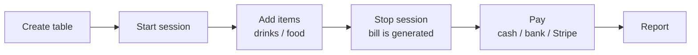
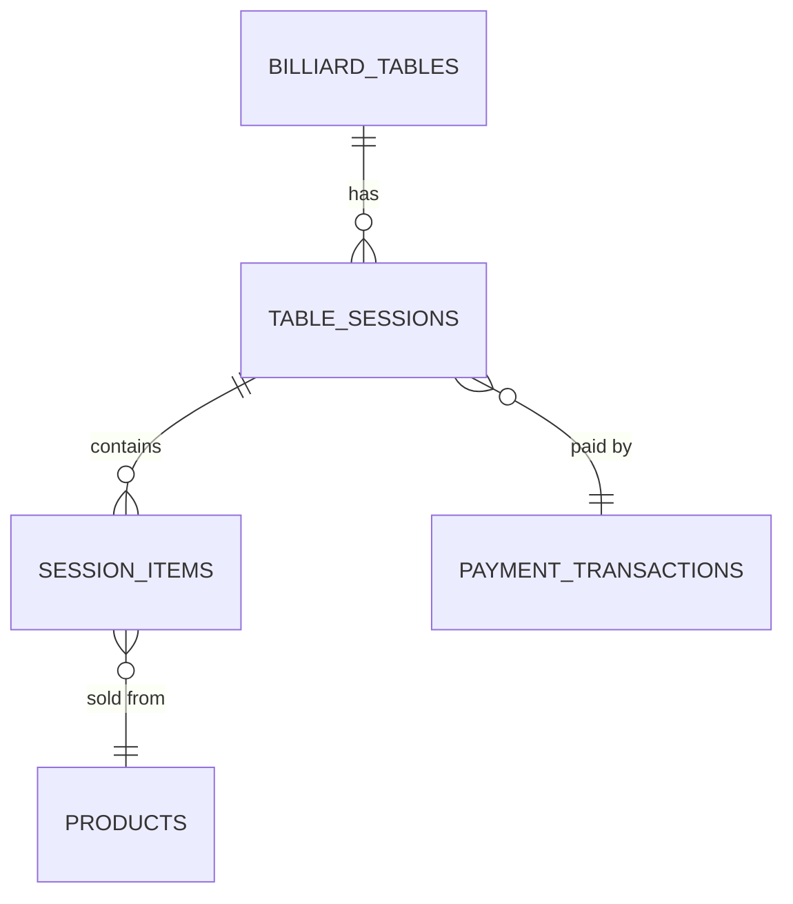
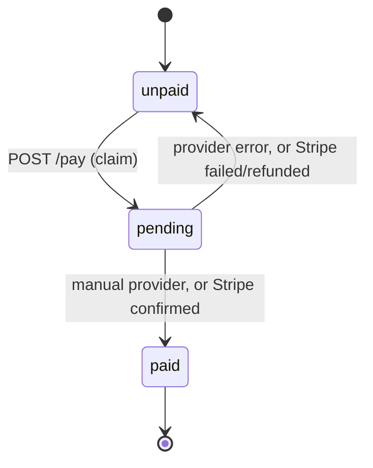

# Billiard (Bida) Module

Manage billiard tables, time-based billing, drinks/food orders, and payment for a club.

> **Status legend** used in this document
> - ✅ **Implemented**: exists in the code today.
> - 🗺️ **Planned**: designed but not built yet (see [Roadmap](#10-roadmap-not-implemented-yet)).

---

## 1. What this module does (in one minute)

A customer sits at a table. The cashier presses **Start**. The customer orders drinks. When they finish, the cashier presses **Stop** and the system prints a **bill**. The customer pays, and the cashier records the **payment**.



| Step | Endpoint | What happens |
|------|----------|--------------|
| Create table | `POST /tables` | Admin/Manager adds a table with an hourly rate |
| Start | `POST /tables/{id}/start` | Opens a session, table becomes `playing` |
| Add item | `POST /sessions/{id}/items` | Adds a product (price is frozen at this moment) |
| Stop | `POST /sessions/{id}/stop` | Calculates the fee, frees the table, returns the bill |
| Pay | `POST /sessions/{id}/pay` | Creates a payment through the Payments module |
| Confirm | `POST /sessions/{id}/pay/confirm` | Settles a gateway (Stripe) payment |
| Report | `GET /reports/tables/usage` | Revenue and usage per table |

---

## 2. Key concepts (glossary)

| Term | Meaning |
|------|---------|
| **Table** (`BilliardTable`) | A physical billiard table with a name, status, and hourly rate |
| **Session** (`TableSession`) | One customer's play period on one table, from Start to Stop. It is also the **bill** |
| **Item** (`SessionItem`) | One product line ordered during a session (e.g. 2 × Coca-Cola) |
| **Snapshot** | A value copied at a point in time so later changes don't affect it (rate, policy, product price) |
| **Billing policy** | The rule used to turn minutes into money (`per_minute` or `rounded_hour`) |
| **Tenant** | One club/business, identified by `client_id`. Tenants must never see each other's data |

---

## 3. Folder structure

```text
app/billiard/
├── config.py          # Billing policy, rounding, currency, payment method mapping
├── models/            # Database tables (SQLAlchemy)
│   ├── table.py       #   BilliardTable, TableStatus
│   ├── session.py     #   TableSession, SessionStatus, PaymentState
│   └── session_item.py#   SessionItem
├── schemas/           # Request/response shapes (Pydantic)
│   ├── table.py
│   ├── session.py
│   └── report.py
├── services/          # Business rules (the "brain")
│   ├── table_service.py     # create/list tables, start session, active tables
│   ├── session_service.py   # add item, stop, get bill
│   ├── payment_service.py   # pay + confirm (bridge to Payments module)
│   └── report_service.py    # usage/revenue report
├── routes/            # HTTP endpoints only (no business logic)
│   ├── table_router.py
│   ├── session_router.py
│   └── report_router.py
└── utils/
    └── billing.py     # Pure functions: billable_minutes, calculate_table_fee
```

### Layer rules (please follow these)

```text
routes  →  services  →  models
(HTTP)     (rules)      (database)
```

- **Routes** only read the request, call a service, and return the response. No business rules here.
- **Services** hold the rules (validation, calculations, locking).
- **`utils/billing.py`** contains pure math with no database access, so it is easy to test.
- Services call `db.flush()`; the **route** calls `db.commit()`.
  - ⚠️ **Exception:** `payment_service.py` commits by itself. See [section 7](#7-payment-flow).

---

## 4. Data model



### `billiard_tables`

| Column | Type | Notes |
|--------|------|-------|
| `id` | int | Primary key |
| `name` | string(50) | Unique per `client_id` (checked in code) |
| `client_id` | string | Tenant owner |
| `status` | enum | `available`, `playing`, `reserved` |
| `hourly_rate` | decimal(12,2) | Current rate; **copied** into each new session |
| `created_at` | datetime | |

> `reserved` exists in the enum, but no endpoint sets it yet.

### `table_sessions`

| Column | Notes |
|--------|-------|
| `table_id` | Which table |
| `start_time`, `end_time` | UTC. `end_time` is empty while active |
| `status` | `active` or `completed` |
| `hourly_rate` | **Snapshot** of the table rate at Start |
| `billing_policy` | **Snapshot** of the policy at Start |
| `duration_minutes` | Filled at Stop |
| `total_table_fee` | Filled at Stop |
| `total_product_fee` | Sum of items, updated whenever an item is added |
| `grand_total` | `total_table_fee + total_product_fee` |
| `payment_state` | `unpaid` → `pending` → `paid` |
| `payment_method` | `cash`, `bank_transfer`, `stripe` |
| `payment_id`, `payment_reference` | Link to the Payments module |
| `paid_at` | When it was paid |
| `opened_by_id`, `stopped_by_id`, `paid_by_id` | Who did each action (audit) |

### `session_items`

| Column | Notes |
|--------|-------|
| `session_id`, `product_id`, `variant_id` | What was sold |
| `product_name` | **Snapshot** of the name |
| `unit_price` | **Snapshot** of the price |
| `quantity`, `total_price` | `unit_price × quantity` |
| `added_by_id` | Who added it |

---

## 5. Business rules

### 5.1 Snapshots protect old bills

When a session starts, the **hourly rate** and **billing policy** are copied into the session. When an item is added, the **name and price** are copied into the item.

Why? If the owner changes a table rate or a product price tomorrow, yesterday's bill must **not** change. Bills and receipts are built only from the snapshot columns, never from `Product` or `BilliardTable`.

### 5.2 One active session per table

Two cashiers pressing **Start** at the same time must not open two sessions. We protect against this twice:

1. **Row lock** on the table (`with_for_update()`, effective on PostgreSQL).
2. **Unique partial index** `uq_one_active_session_per_table` in the database (works on SQLite and PostgreSQL too).

If the race happens, the loser receives `409 Table already has an active session`.

### 5.3 The table is freed at Stop, not at Pay

The bill is generated at Stop, so the table becomes `available` immediately. Payment can happen later; it settles an already-completed session.

### 5.4 Tenant isolation

Every query is scoped by `client_id` through `scope_tables()`:

- **SUPER_ADMIN** sees all clubs.
- **Everyone else** sees only their own `client_id`.
- Requests for another club's session return **404** (not 403), so we don't reveal that the id exists.

### 5.5 Money rules

- The client **never** sends an amount. Payment uses `session.grand_total`.
- All money uses `Decimal`, never `float` (the only `float` is the final conversion needed by `PaymentTransaction.amount`).

---

## 6. Billing calculation

Code: `utils/billing.py`.

### Step 1: billable minutes

```text
minutes = max(MIN_BILLABLE_MINUTES, ceil(seconds / 60))
```

Seconds are rounded **up** to the next whole minute (61 seconds → 2 minutes).

### Step 2: table fee (depends on the policy)

| Policy | Formula | Example: 135 min at 100,000/hour |
|--------|---------|----------------------------------|
| `per_minute` (default) | `rate × minutes / 60` | 100,000 × 2.25 = **225,000** |
| `rounded_hour` | `rate × ceil(minutes / 60)` | 100,000 × 3 = **300,000** |

Then the fee is rounded to `FEE_ROUNDING_UNIT` (for VND you may want `1000`) and quantized to 2 decimals.

### Step 3: grand total

```text
grand_total = total_table_fee + total_product_fee
```

### Full example

```text
Table 01, rate 100,000/hour, policy per_minute
09:00 → 11:15   (135 minutes)
Table fee:       225,000
Products:         85,000   (items added during play)
Grand total:     310,000
```

### Configuration (environment variables)

| Variable | Default | Meaning |
|----------|---------|---------|
| `BILLIARD_BILLING_POLICY` | `per_minute` | Policy for **new** sessions |
| `BILLIARD_MIN_BILLABLE_MINUTES` | `1` | Minimum minutes to charge |
| `BILLIARD_FEE_ROUNDING_UNIT` | `1` | Round the table fee to this unit (`1` = no rounding) |
| `BILLIARD_CURRENCY` | `VND` | Currency label on bills and payments |

Changing these only affects **new** sessions because each session snapshots its own policy.

---

## 7. Payment flow

Payment reuses the existing **Payments** module through `payment_provider_registry`. Billiard does not talk to Stripe directly.

### Method mapping (`config.PAYMENT_METHODS`)

| API `payment_method` | Provider | Result |
|----------------------|----------|--------|
| `cash` | `manual` | Marked paid immediately |
| `bank_transfer` | `manual` | Marked paid immediately |
| `stripe` | `stripe` | Stays `pending` until `/pay/confirm` |

### Payment states



### Why there is a "claim"

The Payments providers call `db.commit()` themselves, so we cannot wrap everything in one transaction. Instead:

1. Lock the session and switch `unpaid → pending`, then **commit** (this is the *claim*).
2. Call the provider. Any second `/pay` call now gets `409 A payment for this session is already in progress`.
3. On success: mark `paid` (cash/bank) or leave `pending` (Stripe).
4. On error: **release the claim** (`pending → unpaid`) so the cashier can retry.

Pre-conditions for `/pay`: the session must be `completed`, not already `paid`/`pending`, and `grand_total > 0`.

> If the payment is created but saving the session fails, an error is logged. The payment's metadata contains `billiard_session_id` so it can be reconciled by hand.

### Stripe example

```text
1. POST /sessions/42/pay          {"payment_method": "stripe"}
   → response has gateway.client_secret  (frontend completes the card payment)
2. POST /sessions/42/pay/confirm
   → backend asks Stripe; if succeeded, payment_state becomes "paid"
```

---

## 8. API reference

All endpoints require a logged-in user (JWT). Roles are noted where required.

### Tables

| Method | Path | Role | Description |
|--------|------|------|-------------|
| `POST` | `/tables` | ADMIN, MANAGER | Create a table. `409` if the name already exists |
| `GET` | `/tables` | any user | List tables (tenant-scoped) |
| `GET` | `/tables/active` | any user | Tables being played now, with live elapsed time and running total |
| `POST` | `/tables/{table_id}/start` | any user | Start a session. `404` unknown table, `409` not available |

### Sessions

| Method | Path | Description |
|--------|------|-------------|
| `GET` | `/sessions/{id}` | Get the bill/receipt (also works after payment) |
| `POST` | `/sessions/{id}/items` | Add an item. `409` if the session is not active |
| `POST` | `/sessions/{id}/stop` | Stop and return the bill. `409` if already completed |
| `POST` | `/sessions/{id}/pay` | Start payment (see section 7) |
| `POST` | `/sessions/{id}/pay/confirm` | Settle a gateway payment |

### Reports

| Method | Path | Role | Description |
|--------|------|------|-------------|
| `GET` | `/reports/tables/usage?start_date=&end_date=` | ADMIN, MANAGER | Usage and revenue per table |

Report notes:

- Date filters apply to the session's `end_time`.
- Tables with zero sessions still appear (the filter is in the JOIN).
- `table_revenue`, `product_revenue`, `total_revenue` count **paid** sessions only.
- `unpaid_total` = completed sessions that are not yet paid.

### Request examples

```bash
# 1. Create a table (admin/manager)
curl -X POST http://localhost:8000/tables \
  -H "Authorization: Bearer <token>" -H "Content-Type: application/json" \
  -d '{"name": "Table 01", "hourly_rate": 100000}'

# 2. Start a session on table 1
curl -X POST http://localhost:8000/tables/1/start -H "Authorization: Bearer <token>"

# 3. Add 2 items of product 5 to session 1
curl -X POST http://localhost:8000/sessions/1/items \
  -H "Authorization: Bearer <token>" -H "Content-Type: application/json" \
  -d '{"product_id": 5, "quantity": 2}'

# 4. Stop and get the bill
curl -X POST http://localhost:8000/sessions/1/stop -H "Authorization: Bearer <token>"

# 5. Pay with cash
curl -X POST http://localhost:8000/sessions/1/pay \
  -H "Authorization: Bearer <token>" -H "Content-Type: application/json" \
  -d '{"payment_method": "cash"}'
```

### Common error codes

| Code | Typical reason |
|------|----------------|
| `400` | Product inactive, or variant doesn't belong to the product |
| `404` | Table/session/product not found, or belongs to another tenant |
| `409` | Wrong state: table busy, session already stopped, already paid, payment in progress, nothing to pay |

---

## 9. How other modules are used

| Module | How billiard uses it |
|--------|----------------------|
| **User/Auth** | `get_current_user`, `require_roles`, `client_id` for tenant scope, user ids for audit columns |
| **Product** | `Product` / `ProductVariant` supply the name and price **once**, at the time an item is added |
| **Payments** | `payment_provider_registry` creates and confirms the payment |

Product and Payments remain the source of truth for their own data. Billiard only stores references and snapshots.

---

## 10. Roadmap (not implemented yet)

🗺️ The items below are the **target design**. None of them exist in the code today, so don't look for these tables or endpoints.

| Feature | Idea |
|---------|------|
| **Games and scores** | Several games inside one session (`table_games`): Player A/B scores, "New game" does **not** restart billing |
| **Electronic scoreboard** | Display with score, elapsed time, start/end time, offline indicator |
| **Central ESP32** | One ESP32 controls all tables over RS485 (never one per table) |
| **Offline mode** | ESP32 keeps a persistent event queue and syncs when Wi-Fi returns |
| **Event idempotency** | Each device event has a unique `event_id` so duplicates never double-count a score |
| **Packages** | Play-time packages that include products |
| **Pricing rules** | Different rates by time of day or day of week |
| **Discounts** | A `discount` field on the session |
| **Cancelled sessions** | A `cancelled` status |
| **Reservations** | Endpoint to set a table to `reserved` |
| **Real-time updates** | WebSocket push to the POS |

### Principle to keep when building the ESP32 part

> The ESP32 controls the **physical** side (buttons, display, local scores). FastAPI stays the **only authority** for billing, prices, payments, and history. The ESP32 must never decide the final bill.

---

## 11. Tips for new developers

1. **Start by reading** `utils/billing.py`, then `session_service.stop_session`. That is the heart of the module.
2. **Never read `Product.price` for an old bill.** Use the `SessionItem` snapshot.
3. **Always scope by tenant.** Use `scope_tables()` (tables) or the check in `get_locked_session()` (sessions).
4. **Use `get_locked_session()`** when changing a session so concurrent requests are serialized.
5. **Keep routes thin.** If you write an `if` about business rules in a router, move it to a service.
6. **Use `Decimal`** for money. Convert numbers with `Decimal(str(value))`, not `Decimal(float)`.
7. **SQLite returns naive datetimes.** Use `as_utc()` from `utils/billing.py` before doing date math.
8. **Adding a new payment method?** Add it to `PAYMENT_METHODS` in `config.py` and to the `Literal` in `PaySessionRequest`. The provider must already exist in `payment_provider_registry`.
9. **Changing a table schema?** Add a migration for deployed databases. `python -m app.init_db` only creates *missing* tables; it does not alter existing ones.